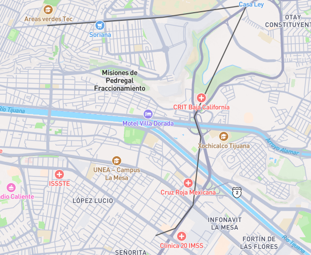
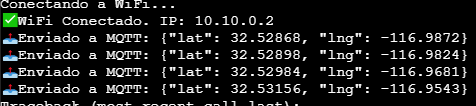
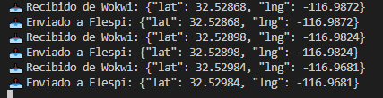
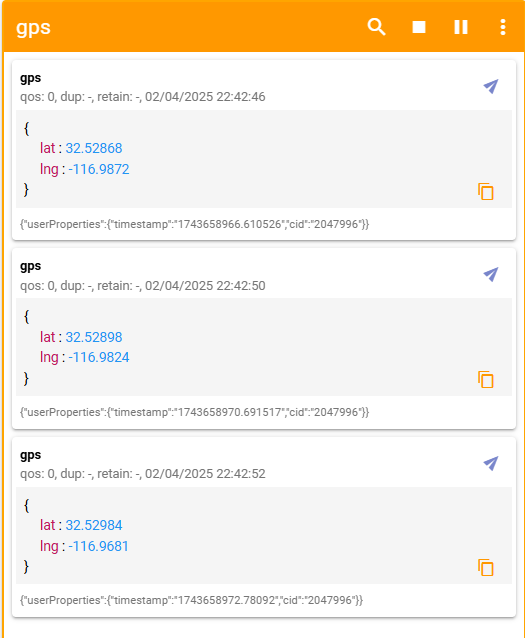
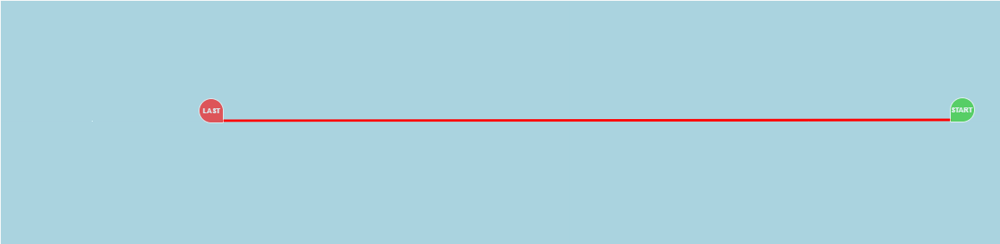

#### 📌 GPS fake Wokwi
**Nombre:** Carlos Alberto Iñiguez Gallego<br>
**Número de Control:** 19211660<br>
**GitHub:** [CarlosAlberto193](https://github.com/CarlosAlberto193)

## 1️⃣ Conceptualizacion del Proyecto
Me base en el trabajo de un compañero (el cual probablemente se haya basado en una salida de ChatGPT) para la manera en la que se maneja el proyecto, mi conflicto resultaba en cargar de mas el emulador de la placa lo que forzaba que este recargara una y otra vez.

**Es por esto que se dividio en tres partes:**

Placa ESP32 en Wokwi ➡️ Sistema Local por MQTT ➡️ Flespi

El cual al final transformaria la informacion obtenida para sus "Tiles"

## 2️⃣ Codigo del Proyecto
### Codigo de Wokwi:
```python
import time
import network
import ujson  # Biblioteca para manejar JSON en MicroPython
from umqtt.simple import MQTTClient
from machine import Pin, UART

SSID = "Wokwi-GUEST"
PASSWORD = ""  # Puedes dejarlo vacío si no hay contraseña
wifi = network.WLAN(network.STA_IF)
wifi.active(True)
wifi.connect(SSID, PASSWORD)

while not wifi.isconnected():
    print("Conectando a WiFi...")
    time.sleep(1)

print(" WiFi Conectado. IP:", wifi.ifconfig()[0])

# Configuración del broker MQTT y tópico
BROKER = "test.mosquitto.org"  # Servidor MQTT gratuito (Wokwi)
TOPIC = "gps/coordinates"  # Tópico para publicar las coordenadas

# Inicialización del cliente MQTT
client = MQTTClient("esp32", BROKER)
client.connect()

# Lista de coordenadas simuladas (Longitud, Latitud)
coordinates = [
    [-116.9872034122678, 32.52867665621845],
    [-116.98244165471823, 32.52897821955416],
    [-116.96809919997145, 32.529844179587656],
    [-116.95428730097385, 32.53155977634171],
    [-116.96295346975208, 32.515947063532664],
    [-116.96187051968201, 32.51318582978871],
    [-116.96314455762706, 32.503689450050516],
    [-116.96609993292658, 32.50043859162764],
    [-116.96933534911773, 32.49943574508025]
]

# Función para enviar coordenadas a MQTT
def send_coordinates():
    for i, (lng, lat) in enumerate(coordinates):  # Manteniendo el orden correcto
        payload = ujson.dumps({"lat": lat, "lng": lng})  # Enviando correctamente
        client.publish(TOPIC, payload)  # Publicar las coordenadas en MQTT
        print(f"📤 Enviado a MQTT: {payload}")
        
        # Esperar 2 segundos antes de enviar la siguiente coordenada
        if i < len(coordinates) - 1:
            time.sleep(2)
        else:
            # Después de la última coordenada, esperar 5 segundos antes de volver a empezar
            time.sleep(5)

# Bucle principal
while True:
    send_coordinates()  # Enviar las coordenadas

```
### Código Python para reenviar datos GPS de Wokwi a Flespi vía MQTT
```python
import time
import paho.mqtt.client as mqtt  # type: ignore

# Configuración de brokers y tópicos
WOKWI_BROKER = "test.mosquitto.org"
WOKWI_TOPIC = "gps/coordinates"  # Asegúrate de que este tópico coincida con el del ESP32

FLESPI_BROKER = "mqtt.flespi.io"
FLESPI_TOPIC = "gps"  # Tópico en Flespi donde se enviarán los datos
FLESPI_TOKEN = "TU_TOKEN_AQUI"  # Reemplazar con tu token de Flespi

# Función de conexión al broker
def on_connect(client, userdata, flags, rc):
    print(f"Conectado al broker con código {rc}")
    client.subscribe(WOKWI_TOPIC)  # Suscribirse al tópico de Wokwi

# Función de manejo de mensajes recibidos
def on_message(client, userdata, msg):
    try:
        payload = msg.payload.decode()
        print(f"📥 Recibido de Wokwi: {payload}")

        # Enviar a Flespi
        flespi_client.publish(FLESPI_TOPIC, payload)
        print(f"📤 Enviado a Flespi: {payload}")

    except Exception as e:
        print(f"⚠ Error al procesar mensaje: {e}")

# Configuración del cliente MQTT para Wokwi
wokwi_client = mqtt.Client()
wokwi_client.on_connect = on_connect
wokwi_client.on_message = on_message

# Configuración del cliente MQTT para Flespi
flespi_client = mqtt.Client()
flespi_client.username_pw_set(FLESPI_TOKEN)

try:
    # Conectar a Flespi
    flespi_client.connect(FLESPI_BROKER, 1883)
    flespi_client.loop_start()

    # Conectar a Wokwi
    wokwi_client.connect(WOKWI_BROKER, 1883)
    wokwi_client.loop_start()

    print("📡 Escuchando datos de Wokwi...")
    while True:
        time.sleep(1)

except KeyboardInterrupt:
    print("\n🔌 Desconectando...")
    wokwi_client.disconnect()
    flespi_client.disconnect()
except Exception as e:
    print(f"❌ Error crítico: {e}")
```

## 3️⃣ Pruebas de Desarrollo
<p align="center">
  
</p>

<p align="center">
  
</p>

<p align="center">
  
</p>

## 4️⃣ Aplicacion en Flespi
<p align="center">
  
</p>

<p align="center">
  
</p>

## 5️⃣ Video en Loom del Funcionamiento
<p align="center">
<a href="https://www.loom.com/share/71c11acc4538480fadf84b376de30c20">
  
</a>
</p>
